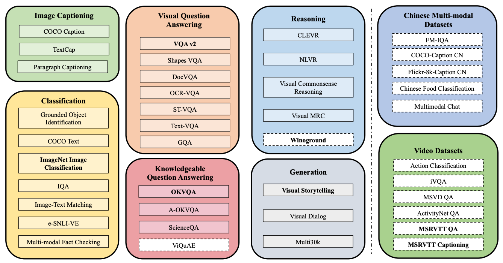

# M$^3$IT: Multi-Modal Multilingual Instruction Tuning Dataset

📃[[Paper]](https://arxiv.org/abs/2306.04387)  💾[[Dataset]](https://huggingface.co/datasets/MMInstruction/M3IT) 🎇[[Demo(Coming Soon)]]()

## Abstract 

Instruction tuning has significantly advanced large language models (LLMs) such as ChatGPT, enabling them to align with human instructions across diverse tasks. However, progress in open vision-language models (VLMs) has been limited due to the scarcity of high-quality instruction datasets. To tackle this challenge and promote research in the vision-language field, we introduce the Multi-Modal, Multilingual Instruction Tuning (M3IT) dataset, designed to optimize VLM alignment with human instructions. Our M3IT dataset comprises 40 carefully curated datasets, including 2.4 million instances and 400 manually written task instructions, reformatted into a vision-to-text structure. Key tasks are translated into 80 languages with an advanced translation system, ensuring broader accessibility. M3IT surpasses previous datasets regarding task coverage, instruction number and instance scale. Moreover, we develop Ying-VLM, a VLM model trained on our M3IT dataset, showcasing its potential to answer complex questions requiring world knowledge, generalize to unseen video tasks, and comprehend unseen instructions in Chinese. To encourage further research, we have open-sourced both the dataset and trained models.

## Task Coverage

Our dataset covers 40 diverse Vision-to-Text Task, featuring Chinese and Video tasks as well:

## Dataset Instance

## Dataset Statistics

